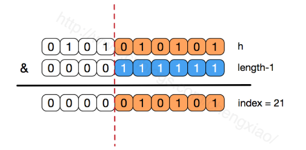

## 集合类
#### HashMap 中的几个中通要参数是什么

#### HashMap 如何解决hash冲突问题

#### HashMap 的长度为什么是2的幂次方
三、为何HashMap的数组长度一定是2的次幂？
数组进行扩容，数组长度发生变化，而存储位置 index = h&(length-1),index也可能会发生变化，需要重新计算index：

>将老数组中的数据逐个链表地遍历，扔到新的扩容后的数组中，我们的数组索引位置的计算是通过 对key值的hashcode进行hash函数运算后，再通过和 length-1进行与运算。

1、保证得到的新的数组索引和老数组索引一致
>16的二进制表示为 10000，那么length-1就是15，二进制为01111，同理扩容后的数组长度为32，二进制表示为100000，length-1为31，二进制表示为011111。从下图可以我们也能看到这样会保证低位全为1，而扩容后只有一位差异，也就是多出了最左位的1，这样在通过 h & (length-1)的时候，只要h对应的最左边的那一个差异位为0，就能保证得到的新的数组索引和老数组索引一致(大大减少了之前已经散列良好的老数组的数据位置重新调换)。

2、获得的数组索引index更加均匀
>数组长度保持2的次幂，length-1的低位都为1

3、唯一性
>&运算，高位是不会对结果产生影响的，所以只关注低位，如果低位全部为1，那么对于h低位部分来说，任何一位的变化都会对结果产生影响，也就是说，要得到index=21这个存储位置，h的低位只有这一种组合。
如果不是2的次幂，也就是低位不是全为1此时，要使得index=21，h的低位部分不再具有唯一性了，哈希冲突的几率会变的更大，同时，index对应的这个bit位无论如何不会等于1了，而对应的那些数组位置也就被白白浪费了

#### HashMap 的底层实现是什么？

#### HashMap 如何进行扩展和删除操作

#### hashCode 和 equals 方法

#### ConcurrentHashMap 如何实现线程安全
