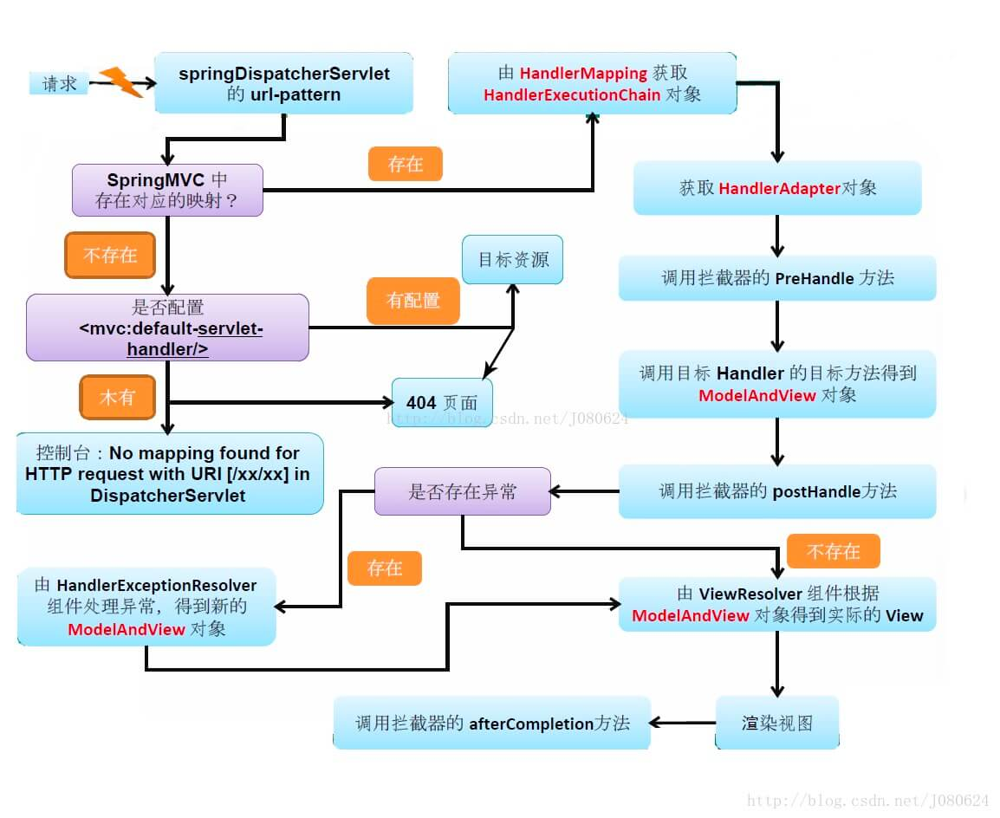

### Spring 面试题
#### Spring的好处是什么？
1. 轻量
2. 控制反转：Spring通过控制反转实现了松散耦合，对象们给出它们的依赖，而不是创建或查找依赖的对象们。
3. 面相切面编程：Spring支持面向切面的编程，并且把应用业务逻辑和系统服务分开。
4. 容器：Spring 包含并管理应用中对象的生命周期和配置。

#### Spring 有多少模块
核心模块：  
Spring Core  
Spring Bean
> 主要组件BeanFactory 他是工厂模式的实现，BeanFactory使用控制反转（IOC）模式将应用程序的配置和依赖性规范预实际的应用程序代码分开。

Spring Context
> Spring 上下文是一个配置文件，向Spring框架提供上下文信息。

EL 模块  
数据访问：
JDBC，Transaction

Web模块：
MVC WebSocket

AOP 模块

#### Spring 框架带来的好处
DI  依赖注入，使得构造器和JavaBean   properties 文件中的依赖关系一目了然  
轻量级  相对于EJB更加的轻量级。  
面向切面变成（AOP）Spring 面向切面编程，同时把应用的业务逻辑和系统的服务分离开。  
集成主流框架：比如Mybatis Logging 等  
模块化  Spring 模块化，可以很方便的去选用自己需要的模块  
Web 框架  做了 一个Spring MVC  
事务管理  
统一异常管理  

#### Spring 用了那些设计模式
1. 代理模式 在AOP中大量使用
2. 单例模式  Spring中配置的Bean对象默认都是单例模式
3. 模板方法  用来解决代码重复的问题，臂包如 RestTemplate  RedisTemplate  
4. 依赖注入 贯穿于 BeanFactory / Application 接口的核心概念
5. 工厂方法  BeanFactory 用来创建对象的实例

#### 什么是Spring Ioc 容器
Spring 框架的核心是Ioc容器，容器创建Bean对象，将他们装配在一起，配置他们并管理他们的完整生命周期。  
- Spring 容器通过依赖注入的方式来管理组成应用程序的Bean对象
- 容器通过读取提供的配置元数据 Bean Definition 来接收对象进行实例化，配置和组装的命令。
- 该配置元数据 Bean Definition 可以通过 XML ，JAVA注解 或Java Config 代码提供。  

#### 什么是依赖注入
在依赖注入中，你不必主动创建对象，但必须描述他们如何创建他们

#### Ioc 和 DI 有什么区别
Ioc 是一种概念叫做控制反转，描述的是类和类还有接口之间的关系，我需要创建对象的时候不是通过直接进行创建，而是通过Ioc容器来进行管理和创建的。这样子就将对象之间的依赖完全解耦出来了。  
DI 叫做依赖注入，就是通过比如set方法，接口注入，构造方法注入  

#### 可以通过多少种方式完成依赖注入？
- 接口注入
- 构造方法注入
- setter注入

#### Spring 有多少Ioc容器
Spring 提供两种Ioc容器，分别是BeanFactory ApplicationContext  
**BeanFactory**
> 由Spring Bean 模块提供

BeanFactory 是一个包含Bean集合的工厂类，他会在客户端需要的时候实例化Bean对象。

**ApplicationContext**  
> 由Spring Context 模块提供

ApplicationContext 接口扩展了BeanFactory 接口，它在BeanFactory 基础上提供了一些额外的功能。内置如下功能：
- MessageSource：管理message，实现国际化等功能
- ApplicationEventPublisher：事件发布
- EnvironmentCapable
- LifeCycle：管理生命周期
- Closable：关闭 释放资源
- InitializingBean：自定义初始化
- BeanNameAware：设置beanName 的Aware 接口。

另外ApplicationContext会自动初始化非懒加载的Bean对象  

#### 常用的BeanFactory 容器？
BeanFactory 最常用的是XmlBeanFactory  

#### 常用的ApplicationContext 容器？
1. ClassPathXmlApplicationContext, 从ClassPath 的XML配置文件中读取上下文，并生成上下文。
2. FileSystemXmlApplicationContext: 由文件系统中的XML配置文件读取上下文。
3. XmlWebApplicationContext 由Web应用的XML文件读取上下文。

#### 列举一下Ioc的好处？
1. 他讲最小化应用程序中的代码量
2. 他以最小的影响和最少的侵入机制促进松耦合
3. 他支持即时的实例化和延迟加载Bean对象
4. 他将更容易进行测试。

#### 简单描述一下Ioc的实现机制。
主要用了工厂模式和反射机制。   

#### 什么是 Spring Bean?
1. Bean 由 Spring Ioc 容器实例化，配置，装配和管理。
2. Bean 是基于用户提供给Ioc通气的配置元数据 Bean Definition 创建。

#### Spring 支持几种Bean Scope?
1. Singleton 单例模式
还有其他的。。。

#### Spring Bean 在容器中的生命周期是什么样子的？
- 实例化Bean对象
  - Spring 容器根据配置信息实例化Bean对象
  - Spring 使用依赖注入填充所有的属性
- 调用相关的方法初始化对象
比如一些Post注解之类的

#### 什么是Spring装配?
当Bean在Spring容器中组合在一起时，他被成为装配或Bean装配。Spring容器需要什么Bean以及容器应该如何使用依赖注入来将Bean绑定在一起，同时装配Bean。  
**自动装配有哪些方式？**  
ByName  ByType

#### 什么叫延迟加载？
默认容器启动的时候会将所有的作用域为单例的Bean都创建好，但是有的业务场景不需要提前创建，此时可以设置 lazy-init=true  
这样容器启动的时候不进行创建，只有在获取的时候在进行创建加载。  

#### Spring 是线程安全的么？
bean对象是单例的，但是并不保证线程安全，需要开发自己控制。一般不会在这些里面添加一些可变的状态，所以可以认为是安全的。

#### 基于注解的容器配置
```
@Configuration @Bean
```
#### 如何启动注解装配?
xml中配置 ``` <context：annotation-config /> ```

#### @Component, @Controller, @Repository, @Service 有何区别？

- @Component  将Java类标记为Bean 他是任何Spring 管理组件的通用构造器。
- @Controller 一个MVC 控制器
- @Service 此注解是组件注解的特化，没有针对@Component 多出来任何的功能，只是标识Service层。更好李杰。
- @Repository 这个注解是具有类似用途和功能的 @Component 注解的特化。它为 DAO 提供了额外的好处。它将 DAO 导入 IoC 容器，并使未经检查的异常有资格转换为 Spring DataAccessException 。

#### @Autowired 注解有什么用？
用在Setter方法 构造函数， 默认使用类型驱动的注入。


#### Spring 面向切面编程（AOP）
1. 解释AOP
面向切面的编程，或AOP， 是一种编程技术，允许程序模块化横向切割关注点，或横切典型的责任划分，如日志和事务管理。   
#### Aspect 切面
Aspect 由 PointCut 和 Advice 组成。
- 他几包喊了横切逻辑的定义，也包含了连接点的定义
- Spring AOP 就是负责实施切面的框架，他将切面所定义的横切逻辑编织到切面所指定的连接点中。  

#### 简单描述一下AOP

#### 如何防止循环依赖
首先只有单例的 非通过构造函数进行创建的进行初始化才能解决了循环依赖。  
因为会从缓存中获取对象，所以是可以解决的。

#### 一个请求过来之后全过程是什么？
1. 发送请求  
用户向服务器发送HTTP请求，请求被Spring MVC 的调度控制器 DispatcherServlet捕获。
2. 映射处理  
DispatcherServlet 根据请求的URL 调用HandlerMapping 获得该Handler配置的所有相关的对象（包含Handler对象以及Handler对象对应的拦截器）最后以HandlerExecutionChain对象形式返回。
3. 处理器适配  
DispatcherServlet根据获得的 Handler，选择一个合适的HandlerAdapter 。（附注：如果成功获得 HandlerAdapter 后，此时将开始执行拦截器的 #preHandler(...) 方法）。  
提取请求 Request 中的模型数据，填充 Handler 入参，开始执行Handler（Controller)。 在填充Handler的入参过程中，根据你的配置，Spring 将帮你做一些额外的工作：
- HttpMessageConverter ：会将请求消息（如 JSON、XML 等数据）转换成一个对象。
- 数据转换：对请求消息进行数据转换。如 String 转换成 Integer、Double 等。
- 数据格式化：对请求消息进行数据格式化。如将字符串转换成格式化数字或格式化日期等。
- 数据验证： 验证数据的有效性（长度、格式等），验证结果存储到 BindingResult 或 Error 中。

Handler(Controller) 执行完成后，向 DispatcherServlet 返回一个 ModelAndView 对象。

5. 解析视图
6. 渲染视图并响应。



#### Spring MVC 统一异常处理
Spring MVC 提供了异常解析器 HandlerExceptionResolver 接口，将处理器( handler )执行时发生的异常，解析( 转换 )成对应的 ModelAndView 结果。
